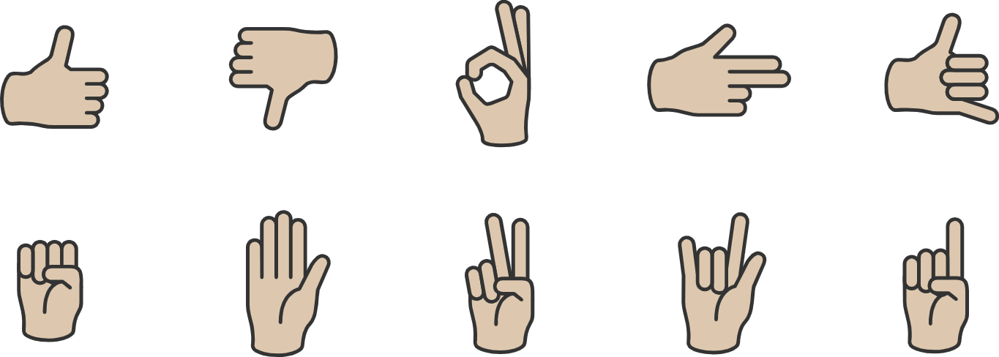

# Speak Italian - Hand Gesture Recognition

Speak Italian is a machine learning project focused on hand gesture recognition. The project utilizes a camera to record frames of hand gestures, employs a pre-trained deep learning model (MediaPipe from Google) to extract features from the images, and applies machine learning techniques to classify the gestures.

## Dataset 
We asked 10 different people to record some frames for every gesture. In the end we collected:
- **Total Data Instances**: 40.000
- **Data Instances per Gesture**: 200 data instances recorded for each gesture made by the same person using the same hand.
- **Features**: Each data instance contains 63 features, where each of the 21 landmarks is represented by three points (X, Y, Z).
- **Classes**: There are 20 classes in total, representing each gesture for both left and right hands.
- **Data Cleaning**: No data cleaning was necessary as the dataset was clean and well-structured from the start.
- **Class Balance**: The classes are perfectly balanced, ensuring equal representation of each gesture.

